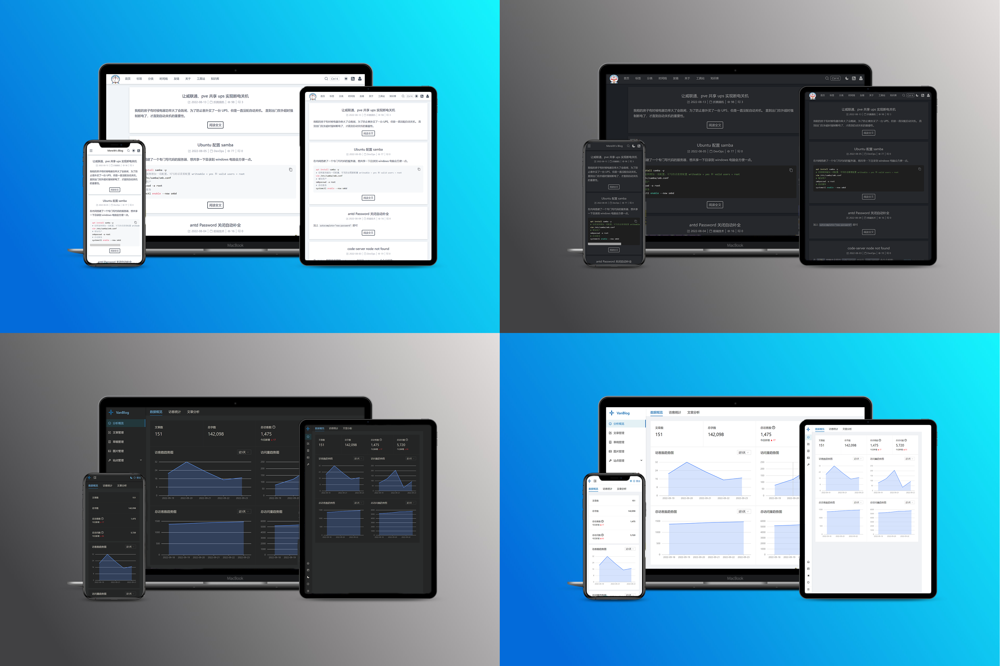
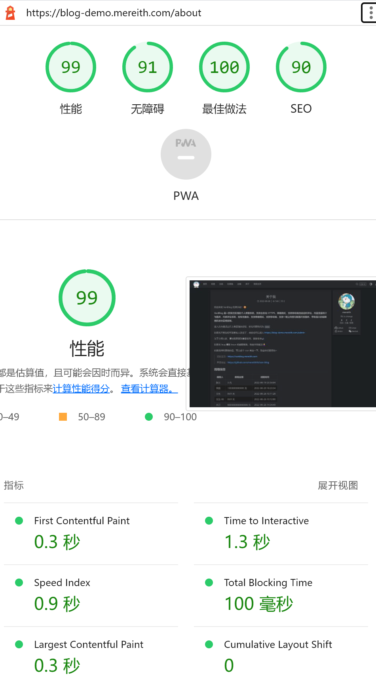

<p align="center">
  <strong>English</strong> | <a href="README.zh-CN.md">简体中文</a>
</p>

<p align="center">
  
</p>

<p align="center">
  <strong>A self-hosted personal blogging system with a complete admin dashboard, Markdown editing, built-in analytics, image hosting, and comments.</strong>
</p>

<p align="center">
  <a href="https://github.com/Mereithhh/vanblog/releases"></a>
  <a href="https://hub.docker.com/r/mereith/van-blog"></a>
  <a href="https://github.com/Mereithhh/vanblog/stargazers"></a>
  <a href="https://github.com/Mereithhh/vanblog/issues"></a>
  <a href="https://github.com/Mereithhh/vanblog/actions/workflows/release.yml"></a>
  <a href="LICENSE"></a>
</p>

<p align="center">
  <a href="https://vanblog.mereith.com">Website &amp; documentation</a> ·
  <a href="https://blog-demo.mereith.com">Live demo</a> ·
  <a href="CHANGELOG.md">Changelog</a>
</p>

The demo admin username and password are both `demo`. The documentation and application interface are currently primarily in Chinese; internationalization is on the roadmap.

## Preview



## Features

- **A complete blogging system.** A public blog, admin dashboard, and backend API, with responsive layouts and automatic light/dark modes for both readers and authors.
- **Static pages with incremental updates.** The Next.js frontend uses static generation (SSG) and incremental static regeneration (ISR), so content changes do not require rebuilding every page. Pages are CDN-friendly, with lazy-loaded images, customizable article URLs, and support for SEO and accessibility.
- **Markdown publishing.** A ByteMD editor with Mermaid diagrams, mathematical formulas, custom highlight blocks, an emoji picker, and a shortcut for the `more` marker. Upload local or clipboard images directly from the editor, import Markdown files, and manage posts and drafts in bulk.
- **Tools for readers.** Tables of contents, code copying, categories, tags, search, password-protected articles and categories, friend links, donation links, custom navigation, and RSS feeds.
- **Built-in analytics.** Visitor statistics and dashboards, plus support for Google Analytics and Baidu Analytics.
- **Integrated comments.** Waline comments with email notifications and webhooks.
- **Image hosting.** Built-in image storage and external storage through PicGo, including object storage and GitHub. Images can be compressed and watermarked on upload.
- **Customization.** Layout settings, custom pages, and custom CSS, HTML, and JavaScript. Extensions can run custom code or call webhooks after selected events. A full theme system and plugin system remain planned work.
- **Collaboration and APIs.** Collaborator accounts with configurable permissions, token management, and APIs for building a separate frontend or integrating another page generator.
- **Deployment and operations.** A guided installation script, Docker deployment with AMD64 and ARM64 support, and automatic on-demand HTTPS certificate issuance and renewal through Caddy. The admin dashboard provides import/export, version and update notices, and access to login and Caddy logs.

## Maintenance and releases

VanBlog uses an automated AI maintenance workflow to reproduce reported code issues, add regression tests, and open pull requests, with corresponding changelog and documentation updates. The maintainer remains responsible for merging into `master` and creating release tags. Issues and pull requests are welcome.

Product releases and deployments are triggered by `v*` tags; documentation deployments are triggered by `doc*` tags. The live demo and documentation site stay on their latest tagged versions, so they may not yet reflect changes on `master`.

If you encounter a problem, first check whether it is resolved in the latest [published release](https://github.com/Mereithhh/vanblog/releases).

## Quick start

### Install with the setup script

```bash
curl -L https://vanblog.mereith.com/vanblog.sh -o vanblog.sh && chmod +x vanblog.sh && ./vanblog.sh
```

If the documentation site is unavailable, use the GitHub raw mirror:

```bash
curl -L https://raw.githubusercontent.com/Mereithhh/vanblog/master/scripts/vanblog.sh -o vanblog.sh && chmod +x vanblog.sh && ./vanblog.sh
```

To run the script again later:

```bash
./vanblog.sh
```

For other deployment options, see the [getting started guide](https://vanblog.mereith.com/guide/get-started.html). The default Docker Compose setup runs VanBlog and MongoDB as separate services.

### Reverse proxies

See the [reverse proxy guide](https://vanblog.mereith.com/reference/reverse-proxy.html).

### Common questions

- [Backups and migration](https://vanblog.mereith.com/guide/backup.html)
- [Author logo or images do not load](https://vanblog.mereith.com/faq/usage.html#图片-作者-logo-加载不出来)
- [HTTP errors after deployment](https://vanblog.mereith.com/faq/deploy.html#部署后-http-error)
- [Slow Docker image downloads](https://vanblog.mereith.com/faq/deploy.html#docker-镜像拉取慢)
- [Accessing the database externally](https://vanblog.mereith.com/faq/deploy.html#如何在外部访问数据库)
- [Rolling back](https://vanblog.mereith.com/faq/update.html#如何回滚)
- [Upgrading](https://vanblog.mereith.com/guide/update.html)
- [Admin errors or continuous loading after an update](https://vanblog.mereith.com/faq/update.html#升级后后台报错或持续加载)
- [Disabling HTTPS redirects](https://vanblog.mereith.com/faq/usage.html#开启了-https-重定向后关不掉)
- [More frequently asked questions](https://vanblog.mereith.com/faq/)

## Development and contributions

VanBlog is a pnpm workspace with a Next.js/React frontend, a NestJS backend using MongoDB, and a Umi/Ant Design admin dashboard. See the [development guide](https://vanblog.mereith.com/contribution.html) and [changelog](CHANGELOG.md).

[Open an issue](https://github.com/Mereithhh/vanblog/issues/new/choose) to report a problem or suggest an improvement. Reproducible code issues enter the automated AI investigation and pull request workflow. Requests to add a site to the showcase are handled by the maintainer, who also handles merges and releases.

## Roadmap

Themes and internationalization are long-standing goals for making VanBlog easier to adapt and use across communities. The following items are planned and are not a list of currently available features:

- [ ] A custom theme / frontend renderer system
- [ ] Internationalization (i18n)
- [ ] A plugin system
- [ ] Quick sharing buttons
- [ ] Browser notifications
- [ ] Revision history for posts and drafts
- [ ] Simpler configuration, with more settings configurable at runtime
- [ ] An ORM layer and support for additional databases

Expanding end-to-end test coverage is also ongoing; [server tests](.github/workflows/server-test.yml) and [admin end-to-end tests](.github/workflows/admin-e2e.yml) already run for pull requests.

For the historical checklist of completed work, see the [Chinese README](README.zh-CN.md#todo).

## Community

- [VanBlog QQ group](https://jq.qq.com/?_wv=1027&k=5NRyK2Sw)
- [Documentation](https://vanblog.mereith.com)
- [Issues and feedback](https://github.com/Mereithhh/vanblog/issues/new/choose)

### Community sites

These sites have been shared by the community. To add yours, [open an issue](https://github.com/Mereithhh/vanblog/issues/new/choose).

- [Mereith's Blog](https://www.mereith.com)
- [GT 的官方博客](https://gt-it.net)
- [無糧不聚兵‘s Blog](https://www.wongcw.cn)
- [oldmoon](https://www.oldmoon.top/)
- [seek.wiki](https://seek.wiki)
- [SnailBlog](https://blog.mldd521.com)
- [Peter's blog](https://niuery.com)
- [我本无罪的博客](https://blog.rnaan.com/)
- [青菜的杂货铺](https://211222.xyz)
- [花菜的博客](https://blog.huacai.one)
- [智芯物联的空间](https://www.tingshuo.online)
- [Done](https://www.dong-blog.fun/)
- [SpaceX](https://tech.twjblog.top/)
- [没想好的个人博客](https://blog.shizhuoran.top/)
- [宁骑播客](https://blog.xintianyuehui.cn/)
- [fanyang](https://fuis.me/)

## Support the project

If VanBlog is useful to you, donations help support its maintenance. Include your preferred name with your donation if you would like to be listed below.

<p align="center">
  
  
</p>

### Donors

This historical list may be incomplete: some past records are missing. Please contact the maintainer if your donation was omitted.

| Donor | Amount (CNY) | Date |
| --- | --- | --- |
| Sirit | 6.66 | 2022-09-01 |
| jingcheng | 100 | 2022-09-06 |
| mosuzi | 100 | 2022-09-08 |
| ym679 | 20 | 2022-09-08 |
| wangcw | 100 | 2022-09-13 |
| ziva | 8.80 | 2022-09-15 |
| Velen | 50 | 2022-09-18 |
| pcz | 50 | 2022-10-19 |
| fanyang | 100 | 2025-06-12 |

## Star history

[](https://star-history.com/#Mereithhh/vanblog&Date)

## Lighthouse

A historical Lighthouse report is shown below. Results depend on the deployment, content, and test conditions.

<p align="center">
  
</p>

## License

VanBlog is licensed under the [GNU General Public License v3.0](LICENSE).
