::: info 提示

本项目处于早期开发阶段 (Early WIP)，如有 bug 请多担待。

:::

本项目使用了 `JavaScript` 和 `TypeScript` 实现。

如果你想参与 VanBlog 开发，可以进群哦：

- [VanBlog 开发群](https://jq.qq.com/?_wv=1027&k=mf2CguM8)

## 准备知识

### 整体架构

Vanblog 分为以下几个部分，构建后将整合到一个 `docker` 容器内：

> website: Vanblog 默认的主题，使用了 `nextjs` 框架，有运行时。
>
> server: Vanblog 的后端服务，有运行时。
>
> waline: Vanblog 内嵌的评论服务，有运行时。
>
> admin: Vanblog 后台面板，打包后为静态页面，无运行时。
>
> caddy: 作为对外的网关，按照规则反代上述几个服务，并提供全自动的 https。

### 进程依赖和启动关系

打包后，启动关系如图：



### 路径结构

本项目采用了 `pnpm` 作为包管理器，项目使用 `monorepo(pnpm workspace)` 组织和管理。

精简版目录结构：

```bash
├── docker-compose  # docker-compose 编排
├── Dockerfile  # Dockerfile
├── docs # 项目文档的代码
├── entrypoint.sh # 容器入口文件
├── LICENSE # 开源协议
├── package.json
├── packages # 代码主体
|  ├── admin # 后台前端代码
|  ├── server # 后端代码
|  ├── waline # 内嵌 waline 评论系统
|  └── website # 前台前端代码
├── README.md
└── pnpm-workspace.yaml # pnpm workspace 文件
```

### 技术栈

只列出大体上框架级别的，一些细节就直接看代码吧。

- 前台： [next.js](https://nextjs.org/)、[react.js](https://reactjs.org/)、[tailwind-css](https://tailwindcss.com/)
- 后台： [ant design pro](https://pro.ant.design/zh-CN/)、[ant design](https://ant.design/)
- 后端： [nest.js](https://nestjs.com/)、[mongoDB](https://www.mongodb.com/)
- CI： [docker](https://www.docker.com/)、[nginx](https://www.nginx.com/)、[github-actions](https://docs.github.com/cn/actions)
- 文档： [vuepress](https://vuejs.press/zh/)、[vuepress-theme-hope](https://theme-hope.vuejs.press/zh/)

## 本地开发

### 环境准备

#### 准备数据库

开发之前，要有一个 `mongodb` 数据库。推荐用 `docker` 起一个：

```bash
docker run --name mongodb-vanblog -d --restart unless-stopped \
  -p 27017:27017 mongo
```

#### node 要求

- nodejs 18
- pnpm v7+

#### 克隆项目并安装依赖

```bash
git clone https://github.com/Mereithhh/vanblog.git
cd vanblog
pnpm i
```

### 添加 server 配置文件

在 `packages/server` 下，创建 `config.yaml` 文件，内容如下：

```yaml
database:
  # 数据库连接
  url: mongodb://localhost:27017/vanBlog?authSource=admin
static:
  # 图床等静态文件保存的位置
  path: /var/vanblog-dev/static
# 是否开启演示站模式，会限制很多权限
demo: 'false'
# waline 用的表名，会自动创建
waline:
  db: waline
# 日志位置
log: /var/vanblog-dev/logs
```

### 开发相关命令

#### 开发全部

在根目录下：

```bash
# 开发全部（前台、后台、server）
pnpm dev
# 前台为 3001 端口
# server 为 3000 端口
# 后台为 3002 端口
```

::: info VanBlog开发后台如果用到复制到剪切板相关的功能，可能需要开启 `https`，请在 `packages/admin/config/config.js` 中的 `https` 改成 `true`，再重启开发进程。

```js
 devServer: { https: true, port: 3002 },
```

:::

#### 单独开发前后台（前端）

必须要先启动 server：

```bash
# 端口 3000
pnpm dev:server
```

然后在启动前台后者后台

```bash
# 启动前台 端口 3001
pnpm dev:website
# 启动后台 端口 3002
pnpm dev:admin
```

### 文档开发

根目录下：

```bash
pnpm docs:dev
```

端口号为: `8080`

## 镜像构建

直接在根目录用 `Dockerfile` 打包就行，具体看下面第二点。

### act（作者自用）

我一般会用 [act](https://github.com/nektos/act) 来做验证镜像，act 可以在本地运行 `Github Actions`。

这个方法需要 `.env` 文件存放密钥，目前仅自用。

```bash
pnpm build:test
```

### 手动打包

```bash
# 这个build server 是第一次打包镜像拿数据的，不写也行，那就得等启动容器后增量渲染生效了。
VAN_BLOG_BUILD_SERVER="https://some.vanblog-server.com"
docker build --build-arg VAN_BLOG_BUILD_SERVER=$VAN_BLOG_BUILD_SERVER -t mereith/van-blog:test .
```

## 文档发版

已经有了对应的 `github actions`，向远端推送 `doc*` 的 `tag` 会触发然后发布到项目官方。

有一键脚本可以在发版之后自动拷贝 changelog 并发布：

```bash
pnpm release-doc
```

## Release

本项目使用 [standard-version](https://github.com/conventional-changelog/standard-version) 管理版本，并有了对应的 `github actions`，执行下列命令会发布版本并触发流水线打包发版。

```bash
pnpm release
pnpm release-doc
```
