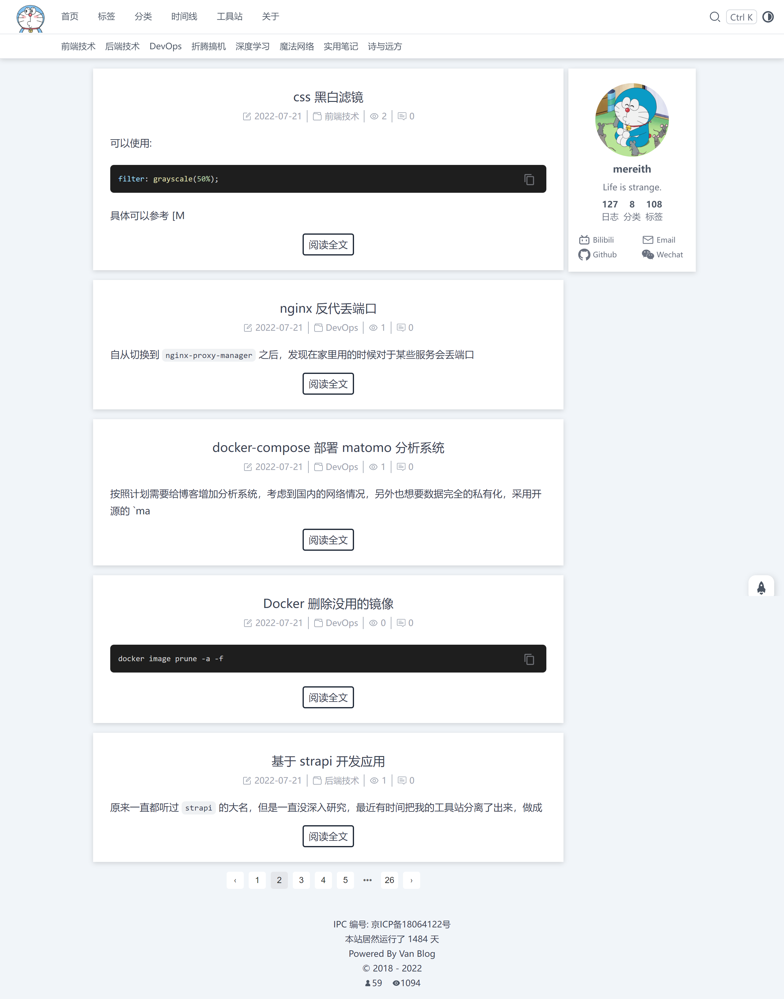
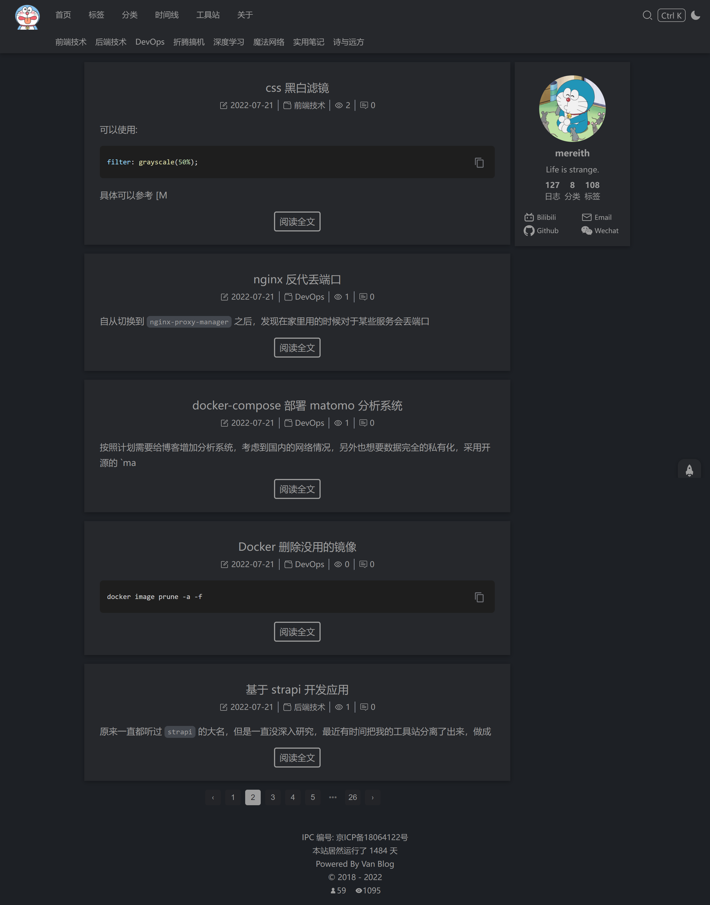
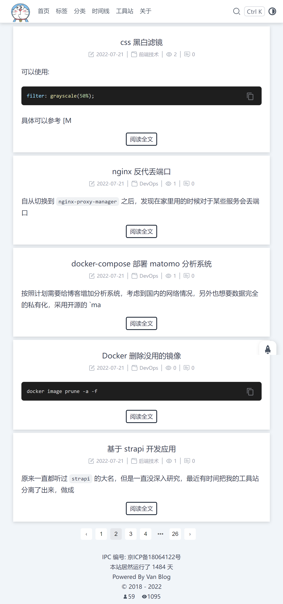
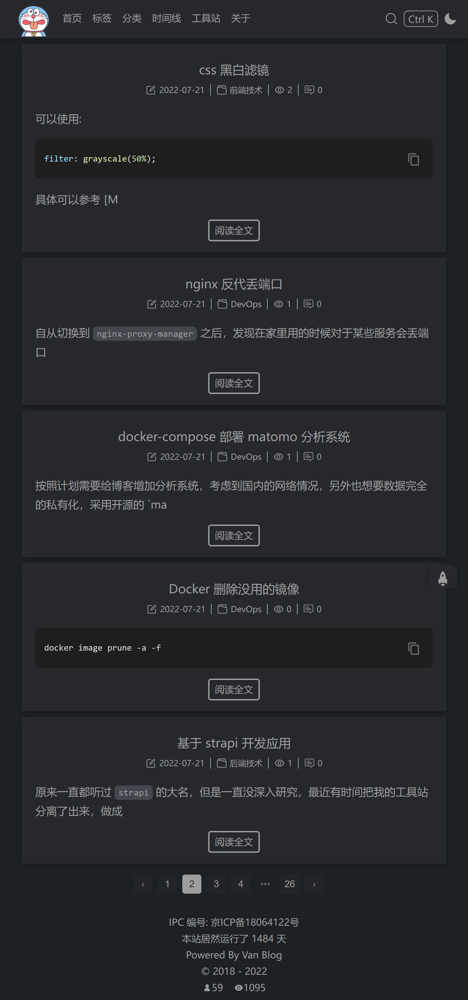
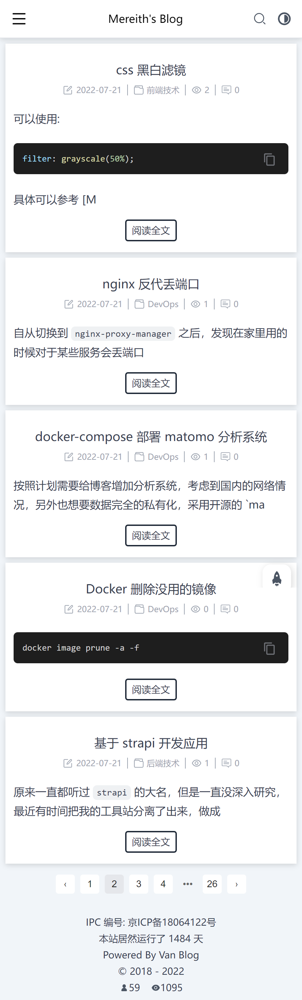
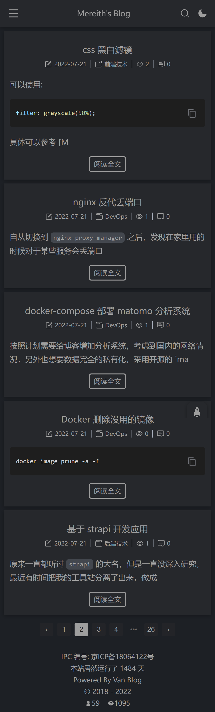
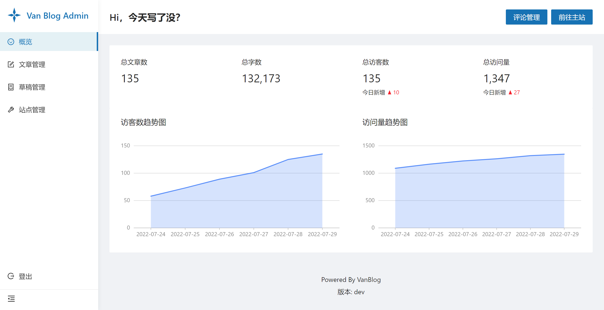
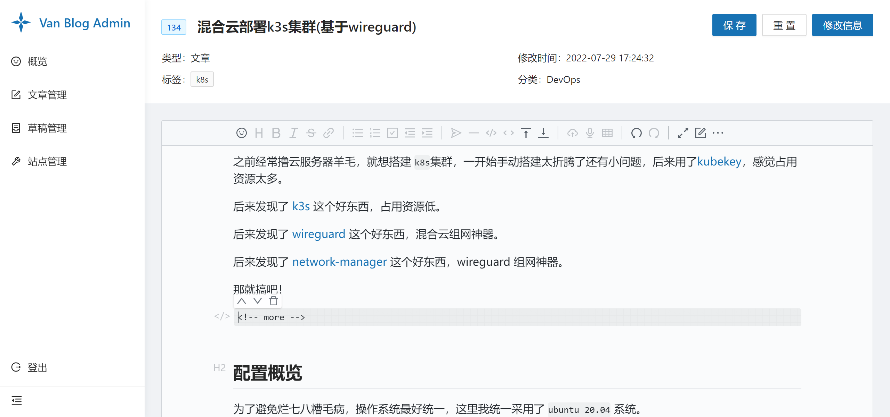

::: info VanBlog

一款简洁实用的个人博客解决方案。

:::

<!-- more -->

## 特性

- 简洁美观：专注于个人博客的应用场景，拒绝花里胡哨。
- 功能强大：搜索、黑暗模式，该有的都有。
- 响应式：无论是电脑、平板还是手机都完美展示。
- 高性能：秒级相应的增量渲染，内置图片优化与缓存。
- SEO 友好：不需要 SSR，我们选择 SSG。
- 可量化：支持百度和 GA，内置浏览量统计。
- ARM Ready: 树莓派、香橙派还是 ArmBian 都行。
- 现代后台：功能齐全的后台页面。
- 易于部署：docker 一键部署。

## 目标

做一个专注于个人博客场景的一站式解决方案。

## Wey not xxx？

- hexo: 本身没有后台，每次写新文章后都要全量构建。
- typecho: 不算 SSG，样式依赖主题。
- wordpress: 有些臃肿，主题繁杂，不简洁。
- hugo: 需要手动配置主题之类的，比较麻烦，需要构建。

## TODO

- [ ] 自带图床
- [ ] 浏览器消息通知
- [ ] RSS 订阅
- [ ] 后台移动端优化
- [ ] 后台黑暗模式
- [ ] 友情链接展示
- [ ] 最近评论展示
- [ ] 捐赠信息展示
- [ ] 搜索可以快捷键选择
- [ ] 404 页面

## 预览图

### PC 端

### 平板端

### 移动端

### 管理后台

