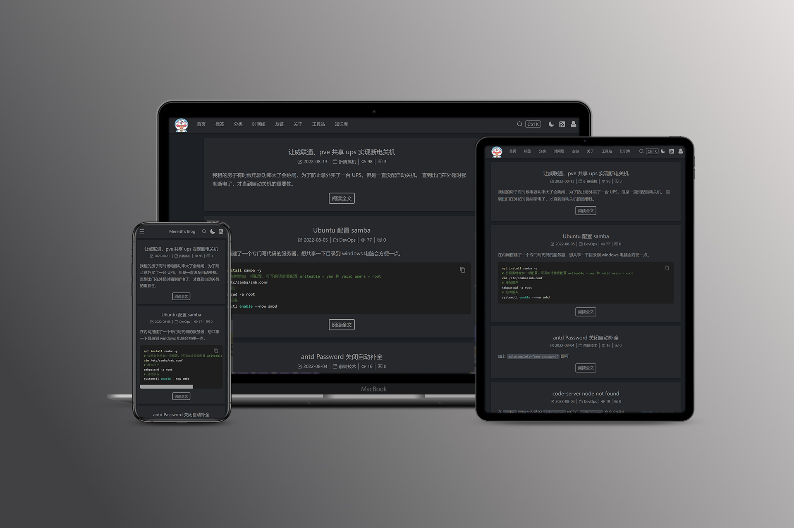
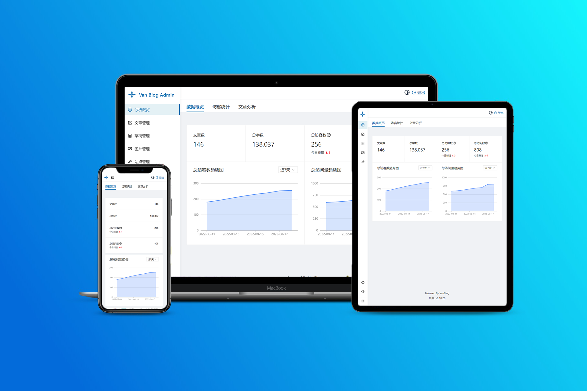
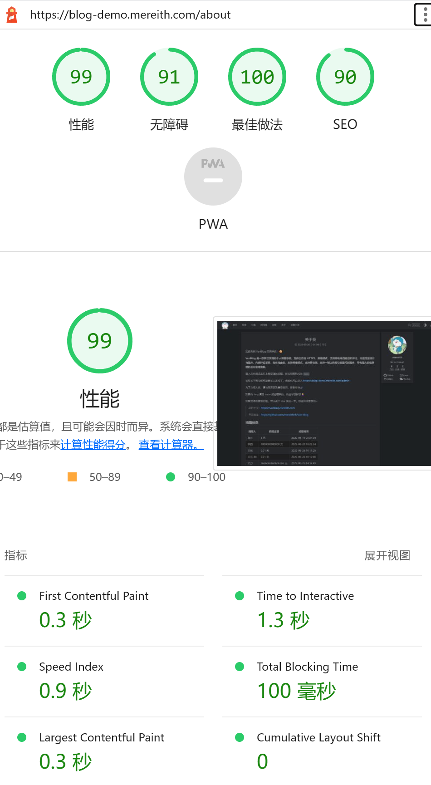

<!-- @include: @/info.snippet.md -->

<!-- more -->

## 特性

- [x] 快到极致的响应速度，Lighthouse 接近满分。
- [x] 独一份的按需全自动 HTTPS，甚至不用填域名。
- [x] 包括完整的前后台和服务端。
- [x] 前台和后台都为响应式设计，完美适配移动端和多尺寸设备。
- [x] 前台和后台都支持黑暗模式，并可自动切换。
- [x] 前台为静态网页（SSG），并支持秒级的增量渲染，每次改动无需重新构建全部页面。
- [x] 静态网页，CDN 友好。
- [x] 基于 React，项目工程化，二次开发友好。
- [x] SEO 和无障碍友好，支持自定义文章路径。
- [x] 版本号展示和更新提醒。
- [x] 内置强大的分析功能，可统计访客等数据。并配有精美看板。
- [x] 内嵌评论系统。
- [x] 强大的 Markdown 编辑器，支持图表和数学公式，一键插入 more 标记，一键剪切板及本地图片上传，支持自定义高亮块语法，支持 Emoji 表情选取。
- [x] TOC、草稿、代码复制、访客数、评论数、分类、标签、搜索、加密、友链、打赏、自定义导航栏。
- [x] 多个布局设置，可自定义页面细节。
- [x] 高度定制化，可添加自定义 CSS、HTML 和 JS 代码。
- [x] 支持自定义页面。
- [x] 可添加具有指定权限的协作者。
- [x] 内置图床，并支持各种 OSS 图床、github 图床（外部图床基于 picgo）等。
- [x] 支持上传图片自动添加水印，无论何种图床
- [x] 极致轻量化，没有花里胡哨。页面秒切换、图片懒加载。
- [x] 脚本一键部署，多种部署方式，支持 ARM 平台。
- [x] 支持 GA、百度分析
- [x] 简单易用的后台，支持数据的导出与导入。
- [x] 支持 RSS 订阅
- [x] 完善的 API，完全利用本项目后台和服务端，自己写前端或适配其他页面生成器
- [x] 有较完善的日志记录，后台可直接查看登录日志和 Caddy 日志。

## 目标

做一个专注于个人博客场景的一站式解决方案。不要那些花里胡哨的，简洁优雅，加载速度要快，该有的都有，拿来就用。

## 初衷

从大学以来，用过各种各样的博客系统，有一个感觉就是都比较 `分离`、`折腾` 和 `不优雅`。

`分离` 是因为很多方案需要很多部件才能一起工作，比如 `hexo` 这种本身没有后台，我必须得用别的编辑器才能写文章，还需要一些工具和方案在构建后把他部署下去。比如我想上传图片还要搞个图床，想统计访客还要单独对接其他的系统。

`折腾` 是因为很多方案很 `依赖主题`，我不是说主题不好，但是太折腾了，而且很多主题花里胡哨的，搞得前台加载速度很慢卡了吧唧的。另外还要折腾图床啊，编辑器啊，优化啊之类的。

`不优雅` 是因为很多主题都没有 `暗色模式`！或者说有了也不能 `自动切换`。另外博客后台我就没见过支持暗色模式还能自动切换的，这让我黑天写博客很难受。另外我也没见过哪个后台 `能把移动端做好的`，都显示多少有点问题。前台响应式有问题的也不少。还有就是图片不能一键上传到图床，也不能剪切板上传，这让我不是很想放图片。

所以就自己写了一个。核心是想搞一个一站式的，能把 `写博客本身` 这件事的体验做到极致的系统。

## Why not xxx？

- hexo/vuepress: 本身没有后台，每次写新文章后都要全量构建。
- typecho: 依赖主题，不带统计分析，后台不好看、移动端拉跨。
- wordpress: 有些臃肿，主题繁杂，不简洁，后台不好看、移动端拉跨。
- hugo: 依赖主题，比较麻烦，需要构建，后台不好看。更多的还没怎么体验。

另外我所见的大多数博客都不够快，相比之下我更想要更快的首屏加载速度 (FCP)，而不是太多花哨的装饰。

## TODO

- [x] 标签管理
- [x] 黑暗模式图标样式优化
- [x] 内嵌评论的邮件通知和 webhook
- [x] 自定义 css
- [x] 添加自定义 script 标签
- [x] 添加自定义 html 代码
- [x] 可添加具有自定义权限的协作者
- [x] 自定义页面
- [x] RSS 订阅
- [x] 导入 md 创建文章/草稿功能
- [x] 支持 mermaid 语法
- [x] 替换编辑器为 bytemd（掘金同款）（老的编辑器有些臃肿，复制偶尔会有格式会错乱的问题）
- [x] 精简前台 js 体积，优化性能
- [x] 后台增加登录日志
- [x] 内嵌评论系统
- [x] 镜像集成 HTTPS 和自动证书申请续期
- [x] 精简打包体积
- [x] 自带图床
- [x] 后台移动端优化
- [x] 后台黑暗模式
- [x] 友情链接展示
- [x] 最近评论展示
- [x] 捐赠信息展示
- [x] 搜索可以快捷键选择
- [x] 高级一点的 404 页面
- [x] 自定义高亮块语法支持
- [x] Emoji 表情选择器
- [x] 自定义导航栏
- [x] 后端性能优化一期（减少不必要的查询， ISR 防抖等）
- [x] Token 管理
- [x] picgo 插件安装
- [x] 忘记密码
- [x] 分类加密
- [x] 自定义文字路径
- [x] 完善可自定义上传文件的自定义页面功能（现在的自定义页面有潜在的 css 污染问题）
- [x] 图片上传自动添加水印
- [ ] 快捷分享按钮
- [x] 系统日志查看
- [x] 增加在特定事件后触发执行自定义代码或 webhook 的扩展能力
- [x] 上传图片自动压缩功能
- [x] 批量操作文章草稿
- [ ] 插件系统
- [ ] 自定义主题（前端渲染器）系统
- [ ] 浏览器消息通知
- [ ] 文章/草稿的历史版本管理
- [ ] 精简配置项，尽可能移动到运行时配置
- [ ] 增加 ORM 层，适配更多数据库
- [ ] 增加一些 e2e 测试，集成到 CI
- [ ] 国际化

## 交流群

- [VanBlog 交流群](https://jq.qq.com/?_wv=1027&k=5NRyK2Sw)

## 打赏

如果你觉得本项目还不错，欢迎打赏。您的支持就是我最大的动力！

::: center

 

:::

## 捐赠信息

| 捐赠者    | 捐赠金额 | 捐赠日期   |
| --------- | -------- | ---------- |
| Sirit     | 6.66 元  | 2022-09-01 |
| jingcheng | 100 元   | 2022-09-06 |
| mosuzi    | 100 元   | 2022-09-08 |
| ym679     | 20 元    | 2022-09-08 |
| wangcw    | 100 元   | 2022-09-13 |
| ziva      | 8.80 元  | 2022-09-15 |
| Velen     | 50 元    | 2022-09-18 |
| pcz       | 50 元    | 2022-10-19 |

::: note

打赏时请备注捐赠者，如有遗漏请联系我添加。（有时候消息多可能会漏掉，十分抱歉）

:::

## 谁在使用

现在可能用的人有一些了吧。

如果您想把自己加进来，请提一个 [issue](https://github.com/Mereithhh/vanblog/issues/new?assignees=&labels=%E6%A0%B7%E4%BE%8B%E6%8F%90%E4%BA%A4&template=add-website.yml&title=%5B%E6%A0%B7%E4%BE%8B%E6%8F%90%E4%BA%A4%5D%3A+)，我会尽快添加的。

- [Mereith's Blog](https://www.mereith.com)
- [handy 的小窝](https://www.handyzyg.cn)
- [GT 的官方博客](https://gt-it.net)
- [無糧不聚兵‘s Blog](https://www.wongcw.cn)
- [oldmoon](https://oldmoon.top)
- [seek.wiki](https://seek.wiki)
- [joker's blog](https://jingjianqian.top)
- [SnailBlog](https://blog.mldd521.com)
- [谷粒 corn.li](https://corn.li)
- [BARM Blog](https://blog.ccz.life)
- [凌览社](http://www.linglan01.cn)
- [Peter's blog](https://niuery.com)
- [我本无罪的博客](https://blog.rnaan.com/)
- [还是夸张一点](https://blog.ynsites.com/)
- [青菜的杂货铺](https://211222.xyz)
- [花菜的博客](https://blog.huacai.one)
- [智芯物联的空间](https://www.tingshuo.online)
- [郭郭的博客](https://blog.warmplace.cn)
- [Done](https://www.dong-blog.fun/)
- [SpaceX](https://tech.twjblog.top/)
- [没想好的个人博客](https://blog.shizhuoran.top/)
- [春天运维之旅](https://blog.tenchuntian.cn/)
- [编程小客栈](http://mystyouth.com/)
- [Newhand](https://newhand.top/)
- [Jerome's Blog](https://www.blog-jerome.top/)
- [宁骑播客](https://blog.xintianyuehui.cn/)
<!-- - [耿老师](https://transfer.teachergeng.space) -->

## 预览图

